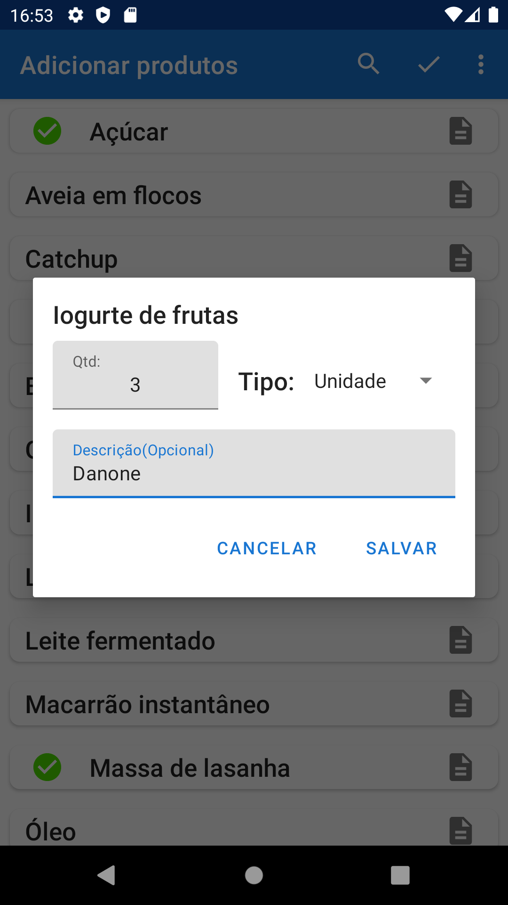

# Aplicativo de lista de compras

Aplicativo de lista de compras, desenvolvido para exercitar conceitos do android:

| Lista de comptas                   | Inserir valor do produto                         | Opçẽs para inserir produto                     |
|------------------------------------|--------------------------------------------------|------------------------------------------------|
|  |  |  |

Ultilizados:
* KOTLIN (linguagem de progração)
* XML (contrução de layouts)
* ACTIVITYS (logica das telas)
* COROUTINES (para executar tarefas fora da thread principal)
* ROOM (salvar os dados localmente)
